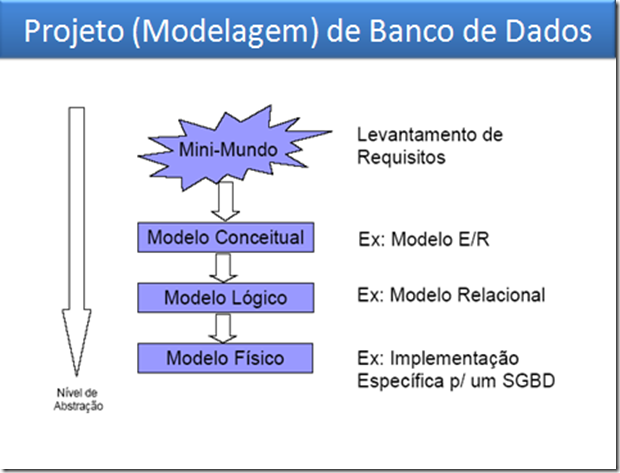

# Introdução ao Estudo de Banco de Dados

Computacionalmente, um Banco de Dados (BD) deve ser utilizado para armazenar informações de acordo com as seguintes características principais:

<!--. Essa ferramenta possui 3 principais características:
-->

* **Armazenar os dados:**

* **Relacionar os dados armazenados:**
    *   Imagine uma base de dados de uma escola que contenha informações sobre os alunos, professores, as disciplinas, as turmas e os cursos. Se não for possível relacionar essas informações, como se saberá quem um determinado aluno faz o curso de Técnico em Informática e tem a aula da disciplina de Banco de dados com um determinado professor?

* **Controle de Redundância:** informações devem possuir um mínimo de redundância visando estabelecer à estabilidade do modelo.
    
* **Recuperar os dados rapidamente:**
    *   Por meio de consultas ao sistema de banco dados. Nos bancos de dados relacionais, as consultas são feitas utilizando-se a linguagem SQL (*Strutured Query Language*, Linguagem de consulta estruturada).
        *   Cabe dizer que existem outros tipos de sistemas de banco de dados além do relacional, embora esse seja o mais utilizado no mercado. 

<!--
## O que é um sistema gerenciador de banco de dados (SGBD)?

Um SGBD é uma ferramenta muito mais completa que um sistema de banco de dados. Um SGBD disponibiliza uma série de funcionalidadades que permitem controlar e acompanhar melhor os dados armazenados.

Um Sistema Gerenciador de Banco de Dados (SGBD) é uma coleção de programas que permite criar estruturas, manter dados e gerenciar as transações efetuadas em tabelas, além de permitir a extração das informações de maneira rápida e segura.

As principais características de um SGBD são:-->

* Permitir o **acesso concorrente às bases de dados**;
    *  Permitir que duas ou mais pessoas acessem a mesma base de dados ao mesmo tempo e o sistema possa controlar que um acesso não interfira no outro;
    * As informações devem estar disponíveis para qualquer número de usuários de forma **comcomitante** e **segura**.
    
* Realizar o gerenciamento de **transações**;
    * uma transação em BD consiste em um conjunto de operações que é tratado como uma **unidade lógica indivisível**. Isso significa que quando começa a execução de uma transação, esta deve ter executadas **todas** as operações dentro dela.
    
* Permitir criar e aplicar regras de **segurança às bases de dados**: necessidade de saber quem pode realizar qual função dentro do banco de dados;
* Permitir criar regras que garantam a **integridade da base de dados**.

* **Backup ou cópias de segurança:** deve haver rotinas específicas para realizar a cópia de segurança dos dados armazenados.

## Fases no Desenvolvimento de um Projeto de Banco de Dados

**1. Modelagem conceitual:**

Modelo inicial de base de dados que reflita as necessidades do usuário, ou seja, *Quais dados serão armazenados*?
        
Um dos principais modelos desta etapa é o **modelo de entidade relacionamento**
 
**2. Modelagem Lógica:**

Compreende o processo de **como** os dados serão armazenados no sistema e **como** irão se relacionar.

Isto significa **transformar o modelo conceitual** obtido na primeira fase em um modelo mais próximo da implementação

Para BD's relacionais, o modelo utilizado nessa fase é o **modelo relacional**
    
**3. Modelagem Física:**
    
Uma vez que toda a etapa de modelagem esteja concluída, será necessário implementar ou criar a base de dados no SGBD (Sistema de Gerenciamento de Banco de Dados) escolhido.

Essa fase requer que o desenvolvedor conheça a linguagem SQL e conheça o SGBD escolhido.

<!-- É importante destacar que algumas literaturas tratam o modelo resultante do modelo lógico, que é dependente de um SGBD específico, de **Modelo Físico**.-->

## Resumo - Fases no Desenvolvimento de um Projeto de Banco de Dados

1. Modelo Conceitual (Modelo de entidade e relacionamento)
2. Modelo Lógico (Modelo relacional)).
3. Modelo Físico (Implementação no SGBD)

## Tipos de Banco de Dados

Alguns tipos de banco de dados:

* **Hierárquico:** representa dados como uma estrutura de árvore, composto de uma hierarquia de registro de dados. 

<!-- Exemplo:

* Nesse caso, há dados específicos em CLIENTE (nome, endereço, cidade, Estado, etc); os segmentos dependentes do CLIENTE são CHKCONTA e GRAVCONTA, que, por sua vez, têm cada um outros dois segmentos dependentes conforme demonstrado no gráfico. Cada um dos segmentos inferiores depende hierarquicamente dos segmentos superiores. Cada um contém dados específicos. É comum encontrá-los em ambientes de grande porte.
-->

* **Rede:** representa os dados como registros vinculados uns aos outros, formando conjuntos comuns de dados. Existe uma similaridade muito grande entre o modelo hierárquico e o modelo de rede. Pode-se entender o modelo de rede como uma generalização do modelo hieráquico, ou este último como um caso particular do modelo de rede. No modelo de rede, um filho pode ter mais de um pai. 

<!--
Exemplo:

-->

* **Relacional:** representa os dados como uma simples coleção de linhas e colunas em tabelas bidimensionais. 

* **Objeto-Relacional:** combina o modelo orientado a objetos (união de propriedades e métodos) com o modelo relacional (linhas e colunas de tabelas).

## Principais Dificuldades

1. Entender a importância da modelagem 
2. Transformar o Diagrama ER (Modelagem Conceitual) para o Modelo Relacional (Modelagem Lógica)

As etapas de modelagem (conceitual e lógica) são as principais fases de desenvolvimento de um banco de dados. Por este motivo, é imprescindível ter atenção no decorrer do estudo pois uma modelagem bem feita fornece benefícios à base dados projetada e, por consequência, a construção de um banco de dados mais sólido.

<!--
## Conteúdo Complementar 

[Slides](https://github.com/IgorAvilaPereira/pmbd2022_2sem/raw/main/1ntroducao.pdf)

-->

**Tipos de Bancos de Dados:**

* [https://youtu.be/1kVGYXneexI](https://youtu.be/1kVGYXneexI)
